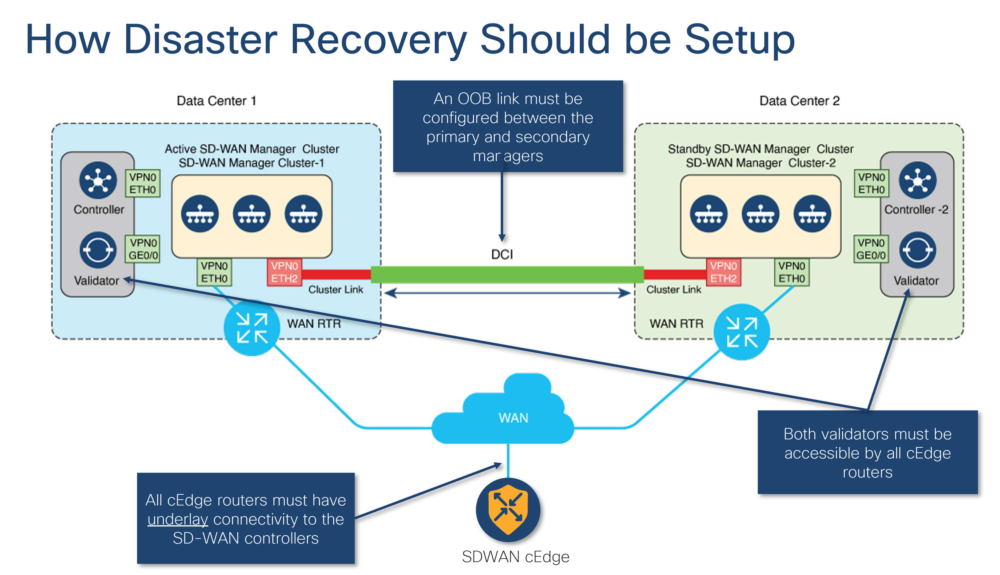
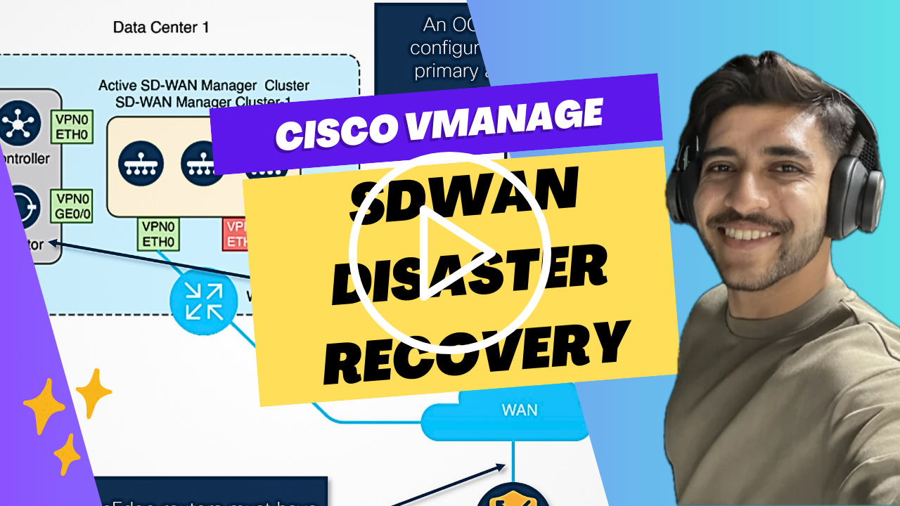
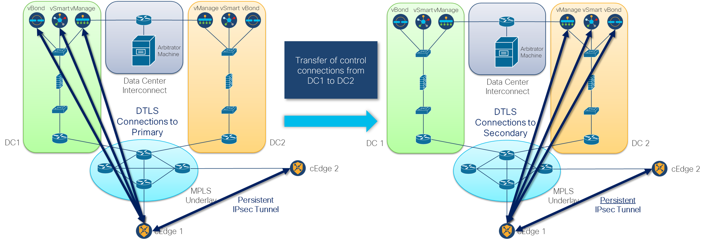

# Automated SDWAN Disaster Recovery
Automated transfer of control from primary SDWAN Manager to secondary Manager in the event of an unforeseen disaster.

## Disaster Recovery Prerequisites

1. All edge routers must have underlay connectivity to the SDWAN controllers (i.e., Managers, Controllers, Validators).
2. An Out-Of-Band (OOB) link must be configured between the primary and secondary Managers.

## Demonstration of SDWAN Disaster Recovery Process

## Diagrammatic Representation of the SDWAN Control Connections from Primary Cluster to Secondary

1. When TLS/DTLS control connections drop between edge routers and the DC1 controllers, new control connections are established between the edge routers and the DC2 controllers.
2. The GRE/IPsec data tunnel between edge1 router and edge2 router remains up persistently. 
3. Suppose DC1 issues are resolved, and DC2 experiences a disaster, new control connections will be established with DC1 controllers again.
4. Suppose DC1 issues are resolved, and the control connections between the edge routers and DC2 controllers have not dropped, no further swinging will take place as DC2 is now considered the primary cluster.
5. Suppose both DC1 and DC2 are down, visibility of the edge routers from a central control plane will end.